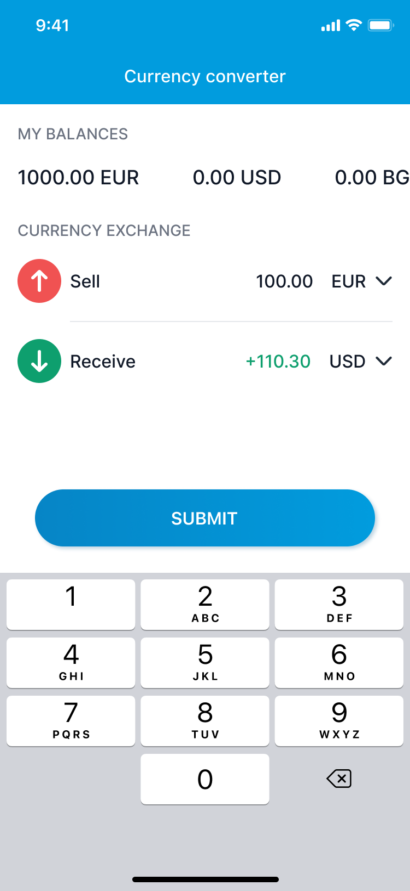
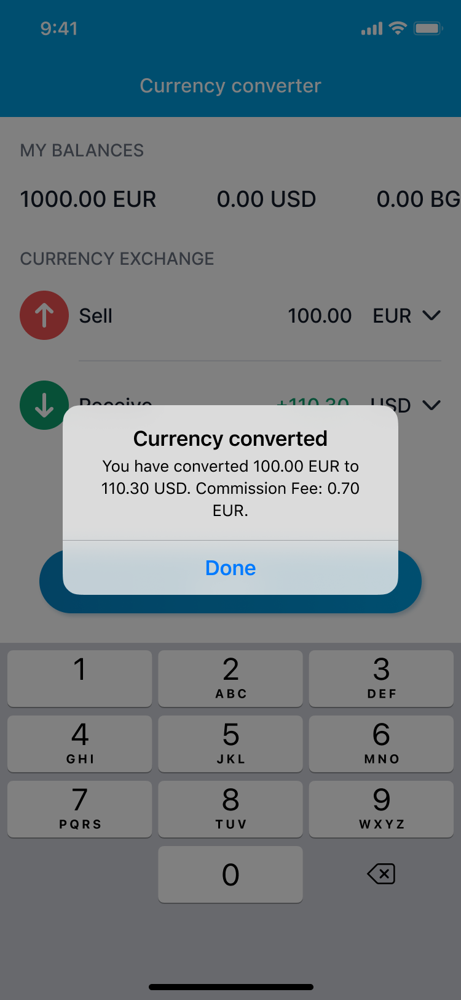

# Currency Exchanger

The user has a multi-currency account with starting balance of **1000 Euros (EUR)**. He can convert any currency to any if the rate is provided by the API but the balance can't fall below zero. Create **an input** where the user will enter amount, **picker** for currency being **sold** and a **picker** for currency being **bought**.

For example, user inputs **100.00**, picks **Euros** to sell and **Dollars** to buy. User then clicks **Submit** button, a message is shown `You have converted 100.00 EUR to 110.30 USD` and now the balance is **900.00 Euros** and **110.30 US Dollars**.

Also, there may be a commission fee for the currency exchange operation. The first five currency exchanges are free of charge but afterwards they're charged 0.7% of the currency being traded. The commission fee should be displayed in the message that appears after the conversion. For example:

```
You have converted 100.00 EUR to 110.00 USD. Commission Fee - 0.70 EUR.
```

The commission fee should be deducted from each currency balance separately.




## Currency Exchange Rate API

- The API is public and no authentication is required
- Currency exchange rates should be synchronized **every 5 seconds**

**URI**: `https://developers.paysera.com/tasks/api/currency-exchange-rates`
Note: Apart from this, please refrain from using Paysera name in your homework task.

**Response example**:

```
{
"base":"EUR",
"date":"2022-10-06",
    "rates":{
        "AED":4.147043,
        "AFN":118.466773
    }
}
```

## Requirements
- the task must be done in **Kotlin**
- there are no strict restrictions on time
- third-party libraries, tools, frameworks can be used
- the system should be maintainable & expandable:
    - a clear relationship between the parts of the code
    - the code is understandable, simple, readable
    - the addition of a new functionality or an existing change should not require rewriting the entire system
    - adding new currency should be easy
    - provide for the possibility of expanding the calculation of a more flexible commission. It is possible to come up with various new rules, for example - every tenth conversion is free, conversion of up to `200 Euros` is free of charge etc.
- balance must be visible somewhere in the UI
- balance can't be negative after the conversion
- the code should conform to the selected code standards (e.g. google java style guide, square java style guide).
- it would be best to test the app before the submission of code.

# Evaluation

- all requirements are met
- code quality
- knowledge of Android ecosystem - libraries, frameworks
- knowledge of best practices, design & architecture patterns
- (insanely) great UI/UX is an advantage
- providing UnitTests is a plus
